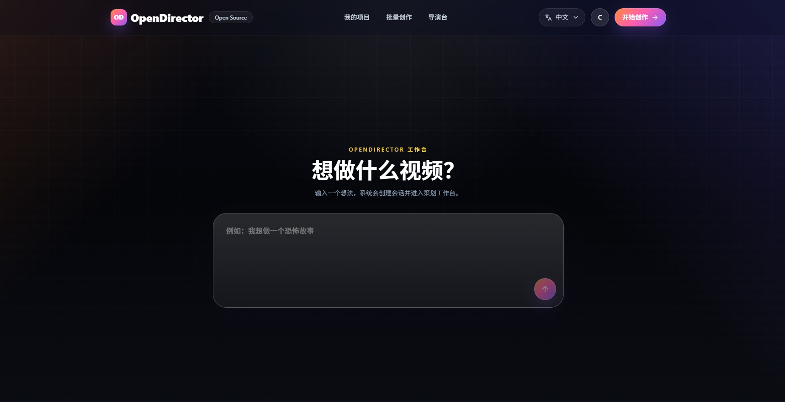
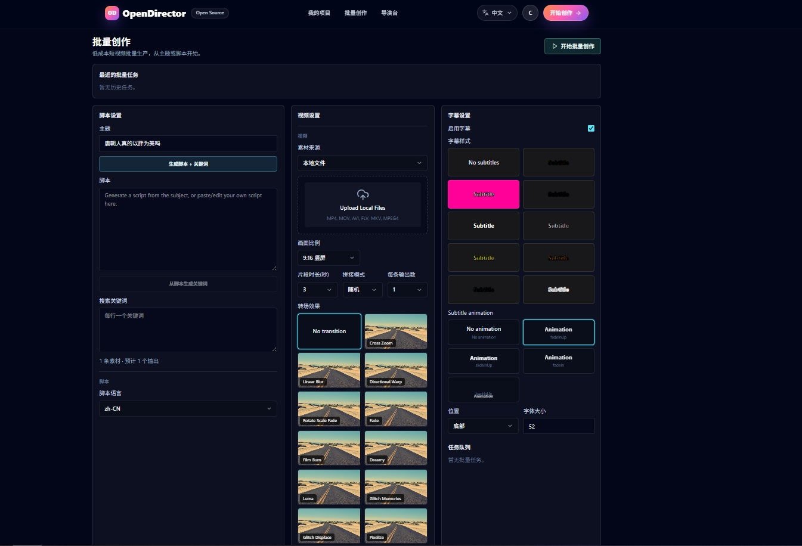
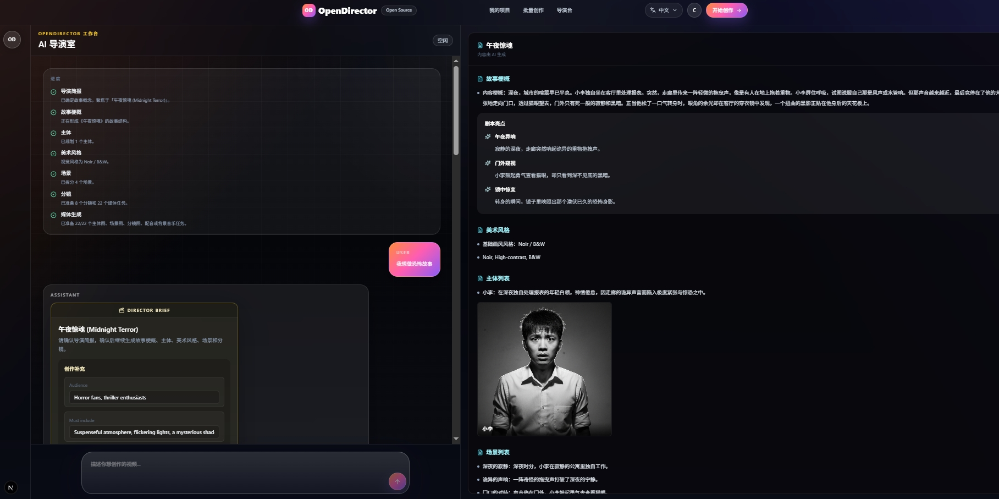
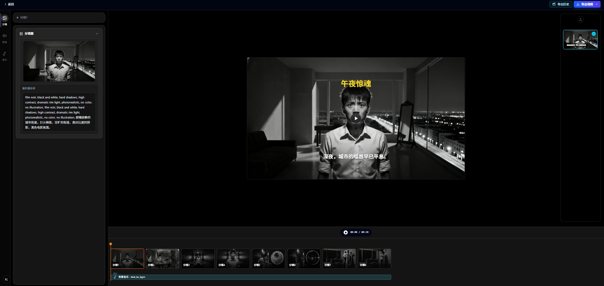

# OpenDirector

> An open-source AI video studio with an 8-agent director pipeline — from a one-line idea to a fully rendered video with voiceover, BGM, and storyboard.

[English](./README.md) | [中文](./README_CN.md)

---

## What is OpenDirector?

OpenDirector is a **Docker-first, self-hosted** AI video production studio. Describe your idea in one sentence, and a team of 8 specialized AI agents collaborate to produce a complete video — with a storyboard, character designs, voiceover, background music, and rendered output.

Just `docker compose up` and start creating.

---

## Screenshots

| AI Director Chat | Batch Production |
|:---:|:---:|
|  |  |
| **Creation Editor** | **Storyboard Preview** |
|  |  |

---

## How It Works

```
Your Idea
   |
   v
[Script Agent] --> [Art Style Agent] --> [Storyboard Agent]
   |                                         |
   v                                         v
[Character Agent]  [Location Agent]    [Voice Agent]  [BGM Agent]
   |                  |                   |              |
   +--------+---------+-------------------+--------------+
            |
            v
     [Media Agent] --> [Render Worker] --> Final Video
```

8 specialized agents work in a pipeline:

1. **Script Agent** — generates the story outline and narrative structure
2. **Art Style Agent** — selects visual style (Cyberpunk, Ghibli, Pixel Art, Photoreal, 3D, or custom)
3. **Storyboard Agent** — breaks the story into scenes with shot descriptions and dialogue
4. **Character Agent** — designs characters with visual prompts and assigns voice profiles
5. **Location Agent** — creates environment concepts for each scene
6. **Voice Agent** — assigns TTS voices matched to character personality and gender
7. **BGM Agent** — generates background music based on story atmosphere
8. **Media Agent** — orchestrates image/voice/music generation into final assets

Each agent is a LangGraph node that streams its output in real-time — you can watch the plan build step by step.

---

## Features

### Creative Mode (AI Director Full Workflow)

- Input one sentence, AI director auto-generates complete plan: brief, story, storyboard, voiceover, images, BGM
- **34 built-in art styles** across 8 categories: Cinematic, Commercial, Futuristic, Retro, Anime, 3D, Illustration, Realistic, Experimental
- **AI-generated story scripts**, editable manually
- **AI voiceover** with multiple voice options, real-time preview
- **AI background music**, auto-generated based on story atmosphere
- **Storyboard preview** with image + voiceover + BGM synced playback
- Support **16:9 / 9:16 / 1:1** aspect ratios
- Export at **480p / 720p / 1080p**

### Batch Mode (Short Video Mass Production)

- Input topics, **AI auto-generates multiple scripts**, batch produce short videos
- **Configurable clip duration** (2-10 seconds), control material switching rhythm
- Support **Chinese and English** video scripts
- **Multiple TTS voices** with built-in Edge TTS (free), real-time preview
- **Subtitle generation** with customizable font, size, color, position, stroke
- **Background music** — random or指定 local files, adjustable volume
- Video materials are **HD and royalty-free** (Pexels / Pixabay), local files also supported
- Generate **multiple videos** at once, pick the best one

### General

- **Multiple AI model providers** — OpenAI, Google Gemini, DeepSeek, Qwen, MiniMax, Ollama, and more
- **Pluggable media providers** — AiHubMix, WaveSpeed, switch via environment variable
- **Docker one-click deploy** — `docker compose up` and you're ready
- **Fully self-hosted** — data stays on your server
- **Chinese and English UI**

---

## Quick Start

### Prerequisites

- Docker & Docker Compose
- (Optional) Node.js 20+ for local development

### One-command start

```bash
git clone https://github.com/seme-org/open-director.git
cd open-director
cp .env.example .env
# Edit .env with your API keys
docker compose up --build
```

Then open **http://localhost:3000**.

### Default services

| Service | URL | Credentials |
|---------|-----|-------------|
| App | http://localhost:3000 | — |
| MinIO Console | http://localhost:9001 | `opendirector` / `opendirector-secret` |
| MySQL | localhost:3307 | See `.env.prod` |
| Redis | localhost:6379 | — |

---

## Media Generation Providers

OpenDirector supports multiple media generation providers through a pluggable architecture. Set `MEDIA_PROVIDER` in `.env` to choose:

### AiHubMix (Recommended)

[AiHubMix](https://aihubmix.com) is a unified AI API platform with free tiers for many models. Register and get an API key at [aihubmix.com](https://aihubmix.com).

```env
MEDIA_PROVIDER="aihubmix"
AIHUBMIX_API_KEY="sk-your-key"

# Image generation (free options available)
AIHUBMIX_IMAGE_MODEL="gemini-3.1-flash-image-preview-free"
AIHUBMIX_IMAGE_EDIT_MODEL="gemini-3.1-flash-image-preview-free"

# TTS (free via Edge TTS)
AIHUBMIX_TTS_MODEL="edge"
EDGE_TTS_VOICE="zh-CN-XiaoxiaoNeural"

# BGM (uses pre-uploaded tracks from database, randomly selected)
```

**Free model options:**
| Capability | Free Model | Notes |
|-----------|-----------|-------|
| Image generation | `gemini-3.1-flash-image-preview-free` | Gemini image generation, has free tier |
| Image editing | `gemini-3.1-flash-image-preview-free` | Same model, for character/scene editing |
| TTS | `edge` | Microsoft Edge TTS, completely free |
| BGM | Local tracks | Randomly selected from pre-uploaded database tracks |
| LLM | `gpt-4.1-free` | For recipe/script generation |

### WaveSpeed

[WaveSpeed](https://wavespeed.ai) provides high-quality AI models for media generation.

```env
MEDIA_PROVIDER="wavespeed"
WAVESPEED_API_KEY="your-wavespeed-key"

# Optional: free alternatives
WAVESPEED_TTS_MODEL="edge"           # Free Edge TTS
WAVESPEED_MUSIC_MODEL="local"        # Free local tracks from database
```

### Provider comparison

| Feature | AiHubMix | WaveSpeed |
|---------|----------|-----------|
| Free tier | Yes (limited calls) | No |
| Image models | Multiple (Gemini, GPT, etc.) | Nano Banana, Seedream |
| TTS | Edge TTS (free) or paid models | MiniMax or Edge TTS |
| BGM | Local tracks (database) | AI-generated or local tracks |
| Setup | Register at aihubmix.com | Register at wavespeed.ai |

---

## LLM Configuration

The LLM is used for recipe generation, script writing, and the AI director. It uses OpenAI-compatible API format.

```env
OPENAI_API_KEY="your-key"
OPENAI_BASE_URL="https://api.openai.com/v1"
OPENAI_MODEL="gpt-4o-mini"
```

**Supported providers:**
- OpenAI (direct)
- AiHubMix (`https://aihubmix.com/v1`)
- Google Gemini (via OpenAI-compatible endpoint)
- Any OpenAI-compatible API (OpenRouter, LiteLLM, Ollama, etc.)

---

## Local Development

```bash
pnpm install
pnpm db:generate
pnpm dev
```

This starts the Next.js dev server on http://localhost:3000.

### Environment files

| File | Purpose |
|------|---------|
| `.env.example` | Documented template for all variables |
| `.env` | Local machine overrides (git-ignored) |
| `.env.prod` | Docker Compose production defaults |

---

## Architecture

```
┌─────────────────────────────────────────────────┐
│                   Next.js App                   │
│  (App Router, React 19, TypeScript, Tailwind)   │
└────────┬──────────┬──────────┬──────────────────┘
         │          │          │
    ┌────▼───┐ ┌────▼───┐ ┌───▼────┐
    │ MySQL  │ │ Redis  │ │ MinIO  │
    │   8.4  │ │   7    │ │  S3    │
    └────────┘ └────┬───┘ └────────┘
                    │
              ┌─────▼──────┐
              │   Worker   │
              │ (FFCreator) │
              └────────────┘
```

### Monorepo structure

```
open-director/
├── apps/
│   ├── web/          # Next.js frontend + API routes + 8 AI agents
│   └── render/       # BullMQ render worker (FFCreator)
├── assets/
│   └── fonts/        # Subtitle rendering fonts
├── prisma/
│   └── schema.prisma # Database schema (voices, art_styles, bgms, etc.)
├── docker-compose.yml
└── package.json
```

### Media provider architecture

```
apps/web/src/server/agent/
├── media-provider.ts          # Types + factory + orchestrator
├── voices.ts                  # TTS voice catalog (loaded from database)
├── art-styles.ts              # Art style catalog (loaded from database)
├── providers/
│   ├── wavespeed.ts           # WaveSpeed implementation
│   ├── aihubmix.ts            # AiHubMix implementation
│   ├── local-bgm.ts           # Local BGM (random track from database)
│   └── wavespeed.test.ts      # Provider tests
└── graph/nodes/recipe/        # 8 LangGraph agent nodes
```

### Tech stack

| Layer | Technology |
|-------|-----------|
| Frontend | Next.js 16, React 19, TypeScript, Tailwind CSS 4 |
| AI | LangChain + LangGraph |
| Database | Prisma + MySQL 8.4 |
| Queue | BullMQ + Redis |
| Storage | MinIO (S3-compatible) |
| Render | FFCreator (FFmpeg-based) |
| Auth | Custom credentials (Prisma-backed) |
| i18n | next-intl (English + Chinese) |

---

## Routes

### Pages

| Route | Description |
|-------|-------------|
| `/` | Landing page |
| `/chat` | AI director studio |
| `/chat/[id]` | Existing conversation |
| `/creation/[id]` | Creation editor (storyboard preview + export) |
| `/space` | User workspace |
| `/batch` | Batch video production |
| `/signin`, `/signup` | Authentication |

### API endpoints

| Endpoint | Description |
|----------|-------------|
| `/api/agent-chat` | AI director chat (streaming) |
| `/api/threads` | Thread CRUD |
| `/api/messages` | Message CRUD |
| `/api/assets` | Asset management |
| `/api/recipes/thread/[id]` | Recipe operations |
| `/api/uploads/init`, `/complete` | File upload |
| `/api/render/quick-concat` | Video render |
| `/api/jobs/[id]` | Job status |

---

## Configuration

### Required

| Variable | Default | Description |
|----------|---------|-------------|
| `DATABASE_URL` | Set in `.env.prod` | MySQL connection string |
| `REDIS_HOST` | `redis` | Redis host |
| `REDIS_PORT` | `6379` | Redis port |
| `S3_ENDPOINT` | `http://minio:9000` | S3-compatible storage endpoint |
| `S3_ACCESS_KEY_ID` | `opendirector` | S3 access key |
| `S3_SECRET_ACCESS_KEY` | `opendirector-secret` | S3 secret key |
| `S3_BUCKET` | `open-director` | S3 bucket name |

### Media generation

| Variable | Default | Description |
|----------|---------|-------------|
| `MEDIA_PROVIDER` | `aihubmix` | Provider: `aihubmix` or `wavespeed` |
| `AIHUBMIX_API_KEY` | — | AiHubMix API key |
| `AIHUBMIX_IMAGE_MODEL` | `gemini-3.1-flash-image-preview-free` | Image generation model |
| `AIHUBMIX_TTS_MODEL` | `edge` | TTS model (`edge` for free) |
| `EDGE_TTS_VOICE` | `zh-CN-XiaoxiaoNeural` | Edge TTS voice |
| `WAVESPEED_API_KEY` | — | WaveSpeed API key |
| `WAVESPEED_TTS_MODEL` | `edge` | WaveSpeed TTS model (`edge` for free) |
| `WAVESPEED_MUSIC_MODEL` | `local` | WaveSpeed BGM model (`local` for database tracks) |

### LLM

| Variable | Default | Description |
|----------|---------|-------------|
| `OPENAI_API_KEY` | — | OpenAI-compatible API key |
| `OPENAI_BASE_URL` | — | API base URL |
| `OPENAI_MODEL` | `gpt-4o-mini` | Model name |

### Batch mode

| Variable | Default | Description |
|----------|---------|-------------|
| `PEXELS_API_KEY` | — | Pexels API key for stock videos |
| `PIXABAY_API_KEY` | — | Pixabay API key for stock videos |
| `BATCH_TTS_PROVIDER` | `edge` | Batch TTS provider |
| `BATCH_EDGE_TTS_VOICE` | `zh-CN-XiaoxiaoNeural` | Batch Edge TTS voice |

---

## Deployment

### Docker Compose (recommended)

```bash
docker compose up -d --build
```

This starts all services: MySQL, Redis, MinIO, web app, and render worker.

### Manual

```bash
pnpm install
pnpm db:generate
pnpm db:migrate
pnpm build
pnpm start
```

---

## Contributing

1. Fork the repository
2. Create a feature branch: `git checkout -b feature/my-feature`
3. Commit your changes: `git commit -m "feat: add my feature"`
4. Push to the branch: `git push origin feature/my-feature`
5. Open a Pull Request

### Development guidelines

- Run `pnpm typecheck` before committing
- Run `pnpm lint` to check code style
- Follow [Conventional Commits](https://www.conventionalcommits.org/) for commit messages

---

## Roadmap

- [ ] AI Digital Human — talking-head video generation with digital avatars
- [ ] Manga Drama — comic panel animation with expression switching and camera effects
- [ ] Multi-language voiceover — expand TTS voice catalog with more languages
